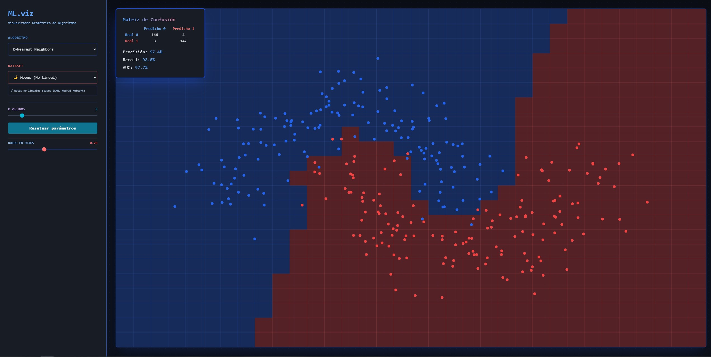

# Visualizador de Modelos de Machine Learning

Esta aplicación web permite explorar visualmente cómo distintos algoritmos de Machine Learning aprenden a separar datos y construir fronteras de decisión. Está diseñada para que estudiantes, docentes y entusiastas puedan experimentar con modelos clásicos y modernos de forma interactiva.

## ¿Qué hace?

La app genera conjuntos de datos sintéticos y permite seleccionar un algoritmo de aprendizaje automático para observar cómo se comporta frente a diferentes tipos de problemas:

- K-Nearest Neighbors (KNN)
- Regresión Logística
- Redes Neuronales (MLP)
- Árboles de Decisión
- Random Forest
- XGBoost

También permite modificar parámetros clave de cada modelo, como:

- el nivel de ruido del dataset
- la cantidad de vecinos en KNN
- la regularización en regresión logística
- la profundidad del árbol
- el número de estimadores en Random Forest o XGBoost

## Funcionalidades principales

- Visualización en tiempo real de la frontera de decisión
- Comparación entre distintos algoritmos y datasets
- Ajuste interactivo de parámetros del modelo
- Mostrar métricas básicas como precisión, recall y AUC
- Interfaz sencilla y amigable para experimentar con ML

## Demo en línea

Puedes probar la aplicación en:

https://visualizacion-render-1.onrender.com/

## Tecnologías utilizadas

- Frontend: Next.js, React, Tailwind CSS
- Backend: FastAPI
- Modelos: scikit-learn y XGBoost

## Estructura del proyecto

- backend/: API que genera los datos y entrena los modelos
- frontend/: interfaz web para interactuar con la aplicación

## Cómo ejecutar localmente

1. Instala las dependencias del backend.
2. Instala las dependencias del frontend.
3. Inicia el backend y el frontend.
4. Abre la aplicación en tu navegador.

Si deseas, también puedes usar los scripts incluidos para lanzar la app más rápidamente.
